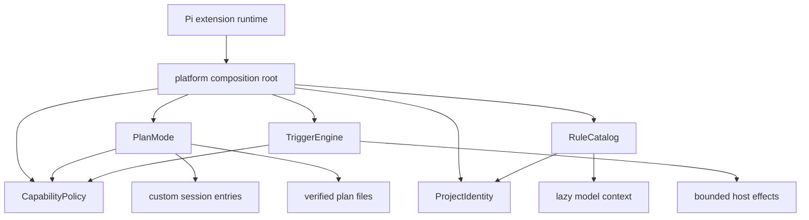

# Phase 2 policy, rules, plan mode, and hook core

Phase 2 adds three deep modules behind the existing platform composition root. User-facing wiring remains one extension so policy and event ordering stay deterministic.



## Deep module interfaces

| Module | Interface | Hidden implementation |
|---|---|---|
| `PlanMode` | `enter`, `recordPlan`, `approve`, `authorize`, `reconcileTools`, `cancel`, `restore`, `status` | state validation, exact tool snapshots, branch traversal, authority verification, destination selection, content hashing |
| `RuleCatalog` | `discover`, `activate`, `inspect`, `reload` | bounded frontmatter parsing, pattern matching, canonical containment, lazy body reads, precedence, epoch deduplication |
| `TriggerEngine` | `register`, `dispatch`, `validate`, `reload`, `start`, `stop`, `inspect` | YAML validation, matcher evaluation, ordering, recursion guard, plan conversion, bounds, redacted history |
| Platform extension wiring | Pi commands, tools, and events | module construction, effect execution, UI, session entries, host-policy intersection, lifecycle order |

Tests and callers cross these interfaces. Filesystem adapters add native integration coverage without exposing file handles or parser nodes.

## Deterministic order

When Phase 2 flags are enabled, the composition root installs handlers in this order:

1. `PlanMode` policy and state wiring
2. `RuleCatalog` activation wiring
3. `TriggerEngine` dispatch and host-effect wiring

Plan-mode denial therefore runs before declarative hook effects. `TriggerEngine` also converts command effects and permissive policy effects into closed denials whenever plan mode is active. A hook `allow` is advisory and never overrides `CapabilityPolicy`.

On shutdown, hook dispatch stops and active hook commands receive abort signals before rules and plan state are released, then `LifecycleSupervisor` closes remaining resources.

## Plan mode

States:

```text
off -> planning -> approval-pending -> executing
  ^        |               |              |
  +--------+---------------+--------------+  cancel
```

`/plan [user|project] <prompt>` captures the exact active tool set, adds dedicated read-only Git tools only for planning, and filters the result through `CapabilityPolicy`. Disabling tools is a usability layer. Every model tool call still crosses policy, so an inactive, dynamically registered, source-overridden, SDK, or unknown tool remains denied when side effects are possible.

A completed plan is written with create-new atomic semantics beneath either:

- user: `~/.pi/agent/plans/`
- trusted project: `<project>/.pi/plans/`

The session entry stores state, destination, exact tool names, and a SHA-256 plan hash. It does not duplicate the plan body. Approval re-reads the file with no-follow containment and verifies the hash. Only a direct UI confirmation can produce the private in-memory authority token required by `approve`. Agent text, hook effects, and custom session messages cannot create that token.

`/plan status`, `/plan approve`, and `/plan cancel` inspect or transition state. Resume, reload, and tree navigation restore from the selected branch rather than the latest physical JSONL entry.

## Lazy rules

Locations:

- user: `~/.pi/agent/rules/**/*.md`
- trusted project: `<project>/.pi/rules/**/*.md`

Startup reads bounded YAML frontmatter only. Bodies remain unread until a prompt, tool input, or search result names a canonical project path matching `include` and not `exclude`. Activation sorts by pattern specificity, priority, project-before-user source, rule ID, and source path. Each rule body enters one caller-assigned context epoch at most once. One activation is capped at 16 rules and 256 KiB of rule bodies; matching inputs are also bounded.

`/rules` reports active state, source, and reason. `/rules reload` atomically replaces the index and resets epoch state. Duplicate IDs, conflicting metadata, malformed files, traversal, and canonical escapes produce diagnostics instead of partial rules.

## Declarative hooks

Locations:

- global: `~/.pi/agent/hooks.yaml`
- trusted project: `<project>/.pi/hooks.yaml`

The parser accepts only `version: 1` with a bounded `hooks` array. Aliases are disabled. Every hook carries source, trust, event, matcher, priority, action, timeout, output cap, and failure policy.

Supported core effects:

- structured command: executable plus argument array, never an implicit shell string
- notify
- namespaced status
- static context injection
- policy decision

The engine returns plain effects. Platform wiring executes them with host cwd, timeout, cancellation, output bounds, and policy checks. Command execution uses a no-shell process runner with a minimal environment, bounded in-memory capture, streaming spill, native Windows process-tree termination, per-hook/global concurrency limits, and bounded shutdown. Nonsensitive truncated output remains in a restrictive temporary spill directory; likely-sensitive output is deleted. Model context and logs receive no output body. Command logs retain bounded outcome metadata only.

`/hooks`, `/hooks validate`, `/hooks reload`, and `/hooks logs` expose configuration and bounded history. Failed reload keeps the last known-good hook set.

## Flags and rollback

`platform.json` enables Phase 2:

```json
{
  "planMode": true,
  "hooks": true,
  "rules": true,
  "plan": {
    "defaultScope": "user",
    "userDirectory": "plans",
    "projectDirectory": ".pi/plans"
  }
}
```

Set any flag to `false`, then run `/reload`, to disable that capability without deleting plans, rules, hooks, or artifacts. With all flags off, platform retains the Phase 1 inert lifecycle surface and registers no Phase 2 commands or tools.
