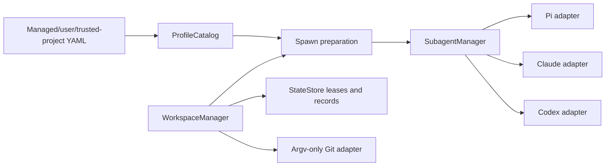

# Phase 3 architecture: profiles and guarded workspaces

## Composition

The parent platform composition root resolves project identity and trust once per session. With Phase 3 flags enabled it creates:

- one immutable-generation `ProfileCatalog`
- one project-bound `WorkspaceManager` for a trusted non-bare Git worktree
- one loader-scoped service binding keyed by Pi's event bus

The subagent extension resolves these authorities at tool execution. Child loaders never receive platform or subagent extensions.



## Profile interface

`ProfileCatalog.reload()` publishes one complete generation. `resolve()` returns immutable:

- identity: name, SHA-256 content digest, generation, source scope/path
- defaults: backend, model, effort
- execution policy: role, instructions/skills, tool allow/deny sets, run limits, workspace policy

Precedence is managed over trusted project over user. Same-scope collisions exclude every colliding candidate. Project sources are not read when trust is false. Running children retain their resolved identity and policy across reloads.

## Spawn preparation

Ad hoc spawn remains compatible. Its raw `working_dir` is explicitly unisolated.

Named profiles use this override matrix:

| Field | Rule |
|---|---|
| prompt/title | call-specific |
| backend | profile authority; matching explicit harness allowed |
| model/effort | explicit call, then profile default, then backend default |
| instructions/skills/role/tools/limits | profile authority |
| workspace policy | cannot be weakened by `working_dir` |

An isolated profile creates a guarded worktree from exact current `HEAD`, claims a fenced lease bound to session/tool owner, profile, role, project identity, and trust, then passes that path to the backend. Spawn failure preserves the worktree and releases its agent lease through explicit preserve disposition.

## Backend policy compilation

- Pi: exact tool allowlist/exclusions, appended instructions, role-bound child loader, shell denial in isolated mode, and write/edit containment under leased root.
- Claude: canonical names map to native tool names through `tools` and `disallowedTools`; isolated mode requires sandbox startup and forbids unsandboxed commands.
- Codex: isolated mode uses `workspace-write` plus developer instructions. Profiles requesting tool restrictions fail because current app-server cannot represent them exactly.
- Supervisor: profile timeout and accepted-run maximum remain backend-independent host limits.

## Workspace state machine

```text
creating -> ready -> leased -> dirty -> reviewed -> integrated
                      |          |          |
                      +----------+----------+-> abandoned
```

`create`, `lease/rebind`, `inspect`, `disposition`, `integrate`, and `recover` are the public interface. Mutations require owner and fence. Records and events use `StateStore`; Git operations are guarded by expiring operation leases. Creation and integration persist intent before Git mutation.

Inspection classifies tracked, staged, untracked, ignored, submodule, detached, unpushed, and index-flag state. `.worktreeinclude` copies bounded regular files/directories only and reports likely secrets.

## Cleanup invariants

- no recursive filesystem deletion
- no caller-supplied cleanup path
- canonical project/worktree identity revalidated immediately before mutation
- links and Windows junctions inventoried without traversal
- each link target identity recorded, link detached, target identity rechecked
- `git worktree remove` is the only tree removal operation
- success requires absent registration and absent lexical path
- partial or failed cleanup remains durable and blocked for recovery

## Result mapping

Subagent snapshots and tool details include immutable profile identity, guarded workspace identity, and explicit `guarded-workspace` or `unisolated` status. Output paths rooted at a guarded workspace are rewritten to the source project root before parent delivery.
