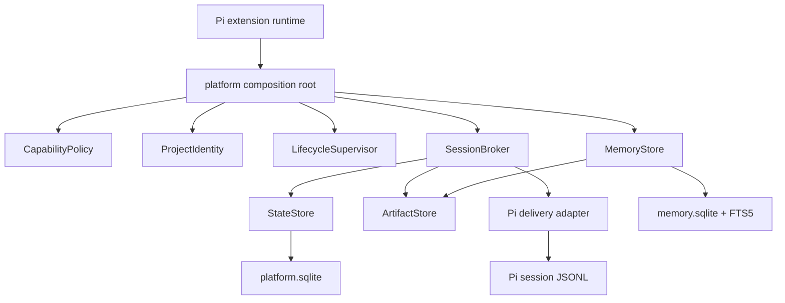

# Phase 6 cross-session messaging and persistent memory

## Decision

Phase 6 adds two host-bound deep modules behind the existing platform composition root:

- `SessionBroker`: `discover`, `send`, `messages`, `close`
- `MemoryStore`: `remember`, `search`, `inspect`, `change`, `transfer`

Callers and tests cross these interfaces. Process proof, fencing, mailbox claims, acknowledgements, SQLite, FTS, artifacts, transcript delivery, redaction, ranking, and erasure remain hidden implementation.

## Composition

Messaging is Parent-only. Memory commands and tools are also composed only for Parent sessions under current platform role policy. Both flags default off.

## Session identity and presence

One **Session Incarnation** combines host-provided Pi session ID, stable Project Identity, Execution Role, and a process-held 256-bit proof. Only a verifier and fenced Lease enter shared state. Requests contain no sender, proof, role, project, authority, timestamp, or fence fields.

`SessionPresence` is opt-in. Defaults deny discovery and receipt. `same-project` compares stable Project Identity, so a repository main checkout and linked worktrees remain related. `local-user` exposure can be enabled only in user configuration. Known session IDs still pass recipient acceptance policy.

A live Lease rejects a second incarnation. Every heartbeat, send, delivery transition, and close validates current owner/fence. Expiry admits a replacement with a higher fence; stale callbacks cannot mutate it.

## Durable mailbox

One send:

1. Rechecks `CapabilityPolicy`; Plan Mode denies orchestration.
2. Validates and sanitizes bounded summary, body, recipients, delivery mode, Session Presence, and capability metadata.
3. Stores one immutable canonical body Artifact.
4. Commits all explicit recipient envelopes in one idempotent StateStore transaction.
5. Returns durable enqueue metadata, not recipient obedience or model completion.

Recipient stream position defines order. Broadcast is an explicit list capped at 32, all-or-none. Mailbox quota and retry ceilings provide backpressure without silent drop.

Delivery is internally at-least-once. The Pi adapter provides an idempotent visible sink:

1. Claim lowest pending position with a fence.
2. Validate project binding, envelope, Artifact, bounds, expiry, and secrets.
3. Record a custom `platform-session-inbox` message with `triggerTurn: false`.
4. Find the exact live entry, fsync the session file, and read back strict UTF-8 JSONL with the same message ID/hash.
5. Return `accepted`; restart returns `already-present` for the same durable entry.
6. Only then mark mailbox row delivered.

This is not a transaction spanning SQLite and JSONL. Crash after JSONL persistence and before mailbox acknowledgement is reconciled by message ID without another visible inbox entry.

`pi/when-idle` delays durable inbox recording until idle. `pi/follow-up` and `pi/steer` first establish the durable inbox receipt, then queue a best-effort hidden notification. Notification queue state never substitutes for delivery acknowledgement or authority.

## Persistent Memory

`MemoryStore` is bound through an opaque host-issued capability. Scope selectors are only `user`, `project`, or `workspace`; raw keys and paths never cross the interface. Project scope uses stable Project Identity. Workspace scope requires a live verified Guarded Workspace Lease and fails closed when the current Pi runtime cannot provide one.

Canonical Memory plaintext is stored in dedicated `memory.sqlite`, not generic StateStore receipts or immutable Artifacts. The database owns:

- current records and revisions
- citations and symmetric Contradiction Links
- content-free idempotency receipts and tombstones
- bounded import previews
- FTS5 lexical projection

FTS scope predicates run inside SQL before candidate output. Canonical records are rechecked after candidate selection. FTS drift rebuilds or fails explicitly rather than returning false empty success.

Remember/edit ordering:

1. Revalidate host capability and scope.
2. Reject or redact secrets before normalization, hashing, comparison, logging, indexing, persistence, or Artifact creation.
3. Apply kind, expiry, citation, content, candidate, and output bounds.
4. Resolve exact/conservative duplicate and advisory contradiction candidates within exact scope/kind.
5. Commit record, revision, citations, links, FTS, and content-free receipt atomically.

Model proposals remain review-only and cannot mutate or squat active Memory. Only direct-user-confirmed commands promote or write active records. Automatic extraction and ambient recall are absent.

Search returns bounded structured hits labeled `untrusted` and `authority: none`. Current user input, repository evidence, policy, and direct approvals remain authoritative.

Forget deletes canonical body, revisions, citation excerpts, links, FTS rows, staging references, and live sidecar copies. Database and FTS secure-delete plus WAL checkpoint must complete before success. Explicit exports are independent copies and cannot be retracted by later forget.

## Public surfaces

Commands, TUI-only:

- `/sessions`
- `/messages`
- `/remember`
- `/memories`
- `/forget`
- `/memory edit|import|export`

Model tools:

- `session_list` - read
- `session_send` - orchestration
- `memory_search` - read

No model-callable Memory write tool exists. Commands recheck policy, wait for idle, show bounded final intent, and require a post-intent TUI confirmation before mutation. RPC, JSON, and print command invocation is rejected clearly.

## Lifecycle

Disabled flags register no Phase 6 surface and start no database, timer, Artifact path, provider call, socket, or process. Memory enabled but unused does not create `memory.sqlite`. Messaging creates shared StateStore only when Parent attach begins; Artifact storage waits for first body.

Start order registers tools before Plan Mode reconciles active tools, then creates Memory binding and attaches messaging after policy/rules/hooks setup. Shutdown fences delivery generation, stops messaging, stops Memory operations, then existing capabilities and lifecycle resources. Failures aggregate without skipping later cleanup.

## Limits and non-claims

- No OS sandbox or same-user filesystem/process isolation
- No strict distributed exactly-once claim
- No truth guarantee for messages, Memory, citations, confidence, or contradiction detection
- No automatic extraction or ambient retrieval
- No forensic erasure from snapshots, backups, crash dumps, exports, or SSD remanence
- No workspace Memory without a live host Lease provider
