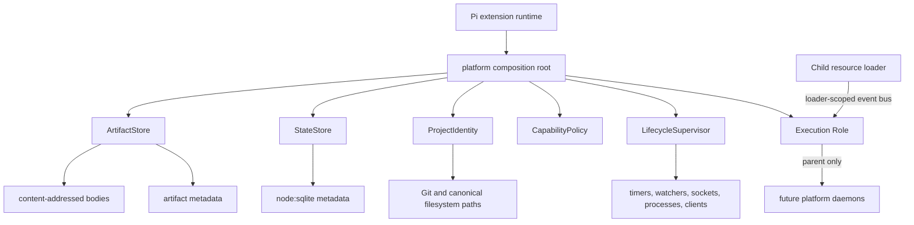

# Platform foundation

Phase 1 adds shared deep modules without enabling user-facing capabilities. Every migration feature flag defaults off.



## Interface seams

| Module | Interface | Hidden implementation |
|---|---|---|
| `LifecycleSupervisor` | `acquire`, `shutdown` | startup races, aborts, deadlines, reverse-order cleanup, failure reports |
| `ProjectIdentity` | `resolve` | Git worktree metadata, canonical paths, junction aliases, stable hashing |
| `CapabilityPolicy` | `decide` | tool classification, conservative defaults, rule precedence, provenance |
| `ArtifactStore` | `put`, `get`, `export`, `collect` | hashing, quotas, immutable bodies, metadata persistence, retention |
| `StateStore` | `transact`, `query`, `compact`, `export`, `diagnose` | migrations, WAL transactions, idempotency, event ordering, fenced leases |

Tests and production callers cross these same interfaces. Adapters expose plain data only. Effect runtimes, SQLite handles, Git subprocesses, and artifact body paths remain hidden.

## Execution roles

```text
parent | subagent | workflow | review | scheduled | goal-worker
```

Role is bound by the host to each resource loader's event bus. It is not read from environment variables, model arguments, or session files. Unbound top-level loaders resolve to `parent`. Only `parent` may acquire future platform daemons. All child roles retain the existing orchestration-tool exclusions during Phase 1.

## Storage split

`StateStore` contains bounded metadata, ordered events, transaction receipts, and fenced leases. `ArtifactStore` contains immutable large bodies addressed by SHA-256. State records may reference artifact IDs; artifact bodies never enter state metadata or model context by default.

## Disabled behavior

With flags off, platform registers no tools, commands, providers, renderers, status items, widgets, headers, or footers. It owns one empty lifecycle supervisor per session runtime so reload and session replacement follow the same shutdown path before capabilities are enabled.

Flag configuration is read from global `platform.json` and trusted-project `.pi/platform.json`. During Phase 1, requested enabled flags remain off and produce independent startup diagnostics. Invalid project config is ignored when project is untrusted.
